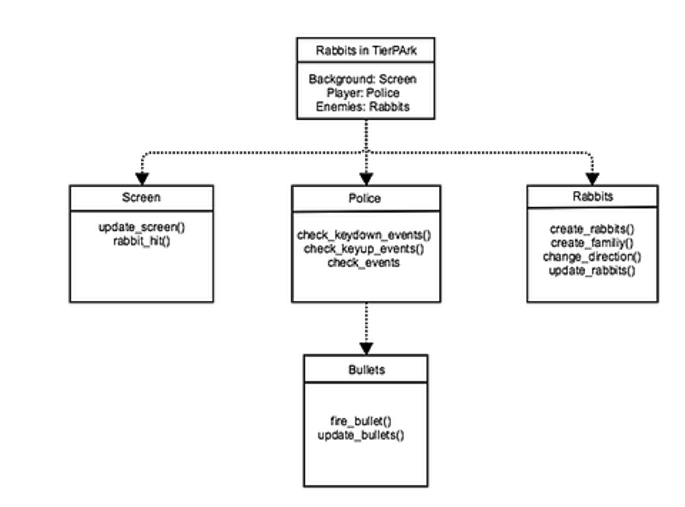
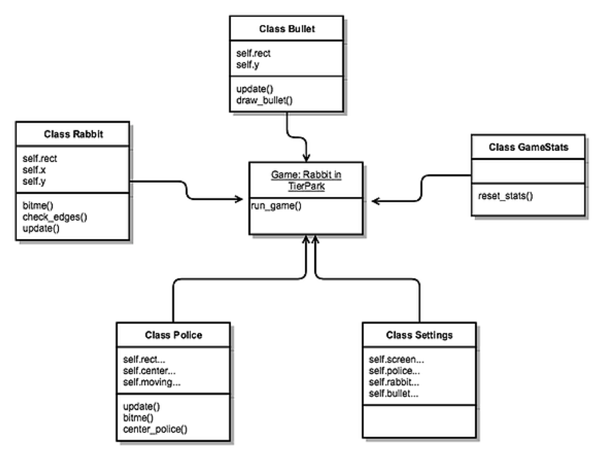

# Pet Project Dashboard Advanced Softwareengineering WS17-18
space invaders like game with angry rabbits and a police man

# Rabbits in TierPark 

Rabbits in TierPark is a game based on the famous game of the late 80s space invaders, a classic game one of the first video games created and very popular.

The motivation to create a version of this game as a pet project, is to understand the basic concepts of programming in python, since I have no experience programming in python, and also apply the concepts seen in the course.

The game is inspired by the book "Curso Intensivo de PYTHON" by author Eric Matthes, which I recommend a lot to learn to program in Python!

# The Game

# UML

In this diagram you can see some action nodes. Yo have a start node and an end node. 
On the right there is a branching. Object nodes are not drawn. In this way, you could insert objects in various places, which are
then available at that point. For example, a rabbit object that is killed by the police after a successful bullet shoot. Or
an object representing the entire game including rabbits and the police.

State Diagram:

In this diagram each box represent one stage of the game  and describe it. Once the game start the player can have 3 states: 1: the police is killing rabbits, 2: The Rabbits kill the police and 3: The police has no more bullets and need to wait for a small period of time till some bullets are free again. The player win, wenn all the rabbits are killed and  loose when the rabbits kill him. 

# SonarQube Scanner

SonarQube performs an anaysis of the pet project; the quality measures and issues instances where coding rules were broken. to see the results please link on the Badget:

The pet project complexity was calculated based on the number of paths through the code. This calculation gave a value of 54, is a low number indicating the code is easy to read. No duplicated blocks, files or lines. Two issues where found for an unused local variable and the other one having two branches in the same if statment. 

Overal Maintainability rating was A! (Remediation cost / Development cost : less than 0.05), no bugs rating A!. In General my code pass the SonarQube scanner no bugs and no vulnerabilities found!. 
